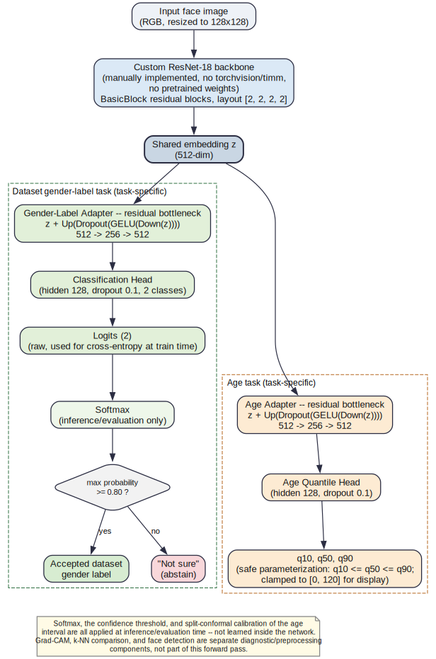
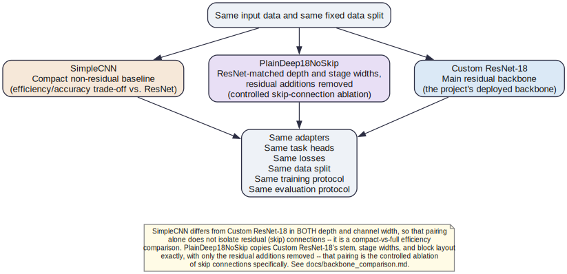
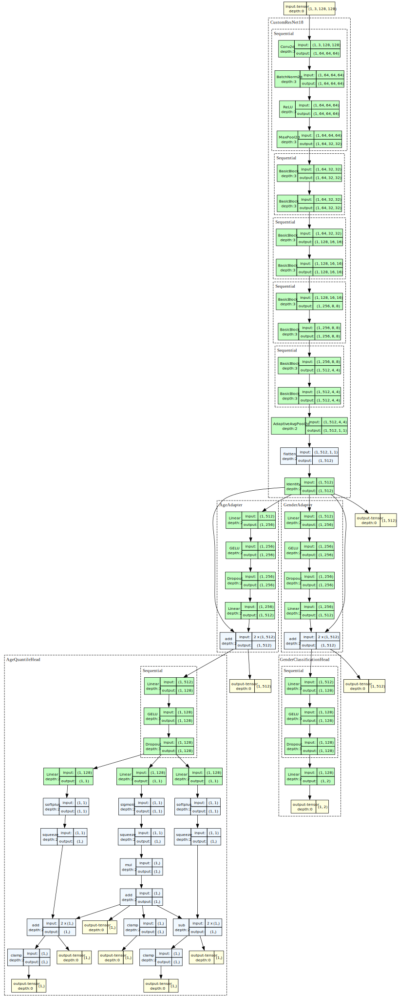
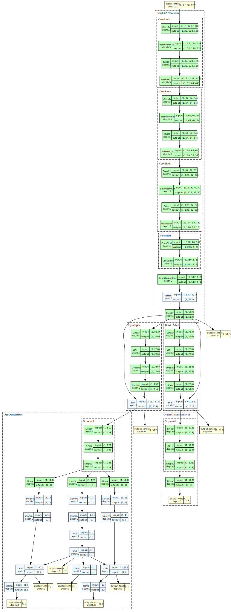
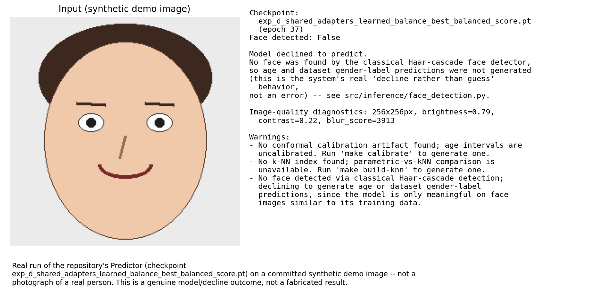

# Model Visualizations

All diagrams on this page are generated by
[`scripts/generate_model_visualizations.py`](../scripts/generate_model_visualizations.py)
directly from the repository's actual code and `configs/*.yaml` -- nothing
here is hand-drawn from memory or invented. They were last regenerated
against commit `3ae2f2c` (2026-07-10). **Regenerate them after any change to
`src/models/*`, `configs/model.yaml`, or `configs/data.yaml`** -- a stale
diagram is worse than no diagram, since a stale one looks authoritative.

## High-Level Multi-Task Architecture



The shared `CustomResNet18` backbone produces one 512-dimensional embedding
`z`. Each task reads `z` through its own residual bottleneck adapter
(`z + Up(Dropout(GELU(Down(z))))`, 512 -> 256 -> 512, see
`src/models/adapters.py`) before its task-specific head (`src/models/heads.py`).
The age head's `(q10, q50, q90)` output is safe by construction
(`q10 <= q50 <= q90`); the values shown are clamped to `[0, 120]` for
display, with the unclamped raw values also available (see
`AgeQuantileHead.forward`). The gender-label head produces raw logits;
softmax, the 0.80 confidence threshold, and "Not sure" abstention are all
applied at inference time in `src/inference/predictor.py`, **not** inside
the trained network. Split-conformal calibration of the age interval
similarly happens outside the model, in `src/evaluation/calibration.py`
(see [docs/calibration.md](calibration.md)). Grad-CAM, the k-NN comparison,
and classical Haar-cascade face detection are separate diagnostic /
preprocessing components, not part of this forward pass.

## Controlled Backbone Comparison



Three backbones (`src/models/backbone_factory.py`) share every other
component -- adapters, heads, losses, data split, training protocol, and
evaluation protocol -- so any performance difference is attributable to the
backbone alone:

- **`SimpleCNN`** (`src/models/simple_cnn.py`): a compact, conventional
  stacked-ConvBlock CNN with no residual connections. It also differs from
  `CustomResNet18` in depth and channel width, so this pairing is an
  efficiency/accuracy trade-off comparison, not a clean ablation of skip
  connections by itself.
- **`PlainDeep18NoSkip`** (`src/models/plain_deep18_no_skip.py`): copies
  `CustomResNet18`'s stem, stage widths, and block layout (`[2, 2, 2, 2]`)
  exactly, with only the residual additions removed. This is the
  depth/width-matched ablation that isolates the causal contribution of
  skip connections specifically.
- **`CustomResNet18`** (`src/models/custom_resnet.py`): the main, manually
  implemented residual backbone actually used by the deployed model
  (`configs/model.yaml: model.backbone.name`).

See [docs/backbone_comparison.md](backbone_comparison.md) for the full
comparison suite (selective prediction, AURC, paired bootstrap, tail-error
analysis) and [docs/architecture_analysis.md](architecture_analysis.md) for
the broader methodology.

## Detailed Computational Graphs

Generated with [`torchview`](https://github.com/mert-kurttutan/torchview)
from a synthetic all-zero input tensor of shape `(1, 3, 128, 128)` -- no
dataset or trained checkpoint is required. Each graph shows the full
`MultiTaskFaceModel` (backbone + both adapters + both task heads) at
`depth=3` with nested modules expanded, which keeps individual `BasicBlock`
/ `ConvBlock` / `PlainBlock` units collapsed to one box each (with their
input/output tensor shapes) rather than expanding every primitive op --
deep enough to see real module structure, shallow enough to stay readable.

**These are automatically generated implementation views of one forward
pass, not conceptual explanations** -- they show tensor shapes and PyTorch
module names, not *why* the architecture is designed this way (see the
high-level diagram and [docs/architecture_analysis.md](architecture_analysis.md)
for that).

### Custom ResNet-18



The main backbone: `stem` -> `layer1..layer4` (each a `Sequential` of two
`BasicBlock`s) -> adaptive average pool -> 512-d embedding -> `AgeAdapter`
/ `GenderAdapter` -> `AgeQuantileHead` / `GenderClassificationHead`. The
`AgeQuantileHead` subgraph shows its safe `q10 <= q50 <= q90`
parameterization explicitly (`sigmoid` for `q50`, `softplus` deltas for the
lower/upper offsets, then a `clamp`).

### SimpleCNN



The compact non-residual baseline: five `ConvBlock`s (`Conv2d` -> `BatchNorm2d`
-> `ReLU` -> optional `MaxPool2d`), channel progression 3 -> 32 -> 64 -> 128
-> 256 -> 512, no `add` nodes anywhere in the backbone -- confirming there
is no residual path. Adapters and heads are identical to the
`CustomResNet18` graph above, as expected (they don't depend on the
backbone choice).

### PlainDeep18NoSkip


Same stem, stage widths, and block layout as Custom ResNet-18 -- but built
from `PlainBlock` instead of `BasicBlock`, and (like `SimpleCNN`) with no
`add` nodes in the backbone, since `PlainBlock.forward` never adds an
identity/projection shortcut. Comparing this graph against the Custom
ResNet-18 graph above is the most direct visual evidence of what the
residual connections actually change.

## Example Prediction Output



This figure is produced by actually instantiating the repository's
`Predictor` (`src/inference/predictor.py`) with a real trained checkpoint
(`checkpoints/exp_d_shared_adapters_learned_balance_best_balanced_score.pt`,
the same checkpoint `configs/api.yaml` points the deployed API at) and
running it on a committed synthetic demo image
(`data/demo_images/`, procedurally drawn with PIL primitives -- no real
person, no dataset content). No numbers are invented.

In practice, the classical Haar-cascade face detector
(`src/inference/face_detection.py`) does not recognize a face in these
cartoon-style images (a real, previously documented limitation --
see `data/demo_images/README.md`), so the genuine, reproducible outcome
shown is the system **declining to predict** rather than guessing --
exactly the "decline rather than guess" safety behavior described in the
README and `docs/model_card.md`. This is not an error and was not worked
around: bypassing face detection to force a numeric prediction on an
out-of-distribution synthetic drawing would misrepresent what the model
actually does. If you supply your own consented photo through the frontend
demo, the same figure layout would instead show real age quantiles, a
dataset gender-label decision (or abstention), and quality diagnostics.

## Regenerating the Assets

```bash
pip install -r requirements-visualization.txt   # torchview + graphviz (Python)
# also requires the Graphviz system executable ("dot") on PATH
make model-visualizations
# or directly:
python scripts/generate_model_visualizations.py --output-dir docs/assets --device cpu
```

Optional flags: `--checkpoint <path>` to use a specific checkpoint for the
prediction-output example (default: `configs/api.yaml`'s
`active_checkpoint`, if it exists locally), `--demo-image <path>` to pick a
different input image, and `--skip-graphs` to skip the `torchview`
computational graphs (useful if `torchview`/Graphviz aren't installed --
the two hand-drawn diagrams and the prediction example still generate).

The script never downloads anything, never requires a prepared dataset,
and falls back to an explicitly labeled illustrative layout (no numbers)
for the prediction-output example if no trained checkpoint is available
locally.

## Interpretation Limitations

- The high-level architecture diagram is a conceptual simplification. It
  intentionally omits progressive-freezing stage logic, the `separate` and
  `shared_no_adapters` architecture modes (see
  `src/models/multitask_model.py`), and the learned-uncertainty loss
  balancer -- see `docs/architecture_analysis.md` for those.
- The `torchview` graphs are **implementation views of a single forward
  pass with a synthetic input**, not an explanation of *why* the network is
  designed this way, and not a claim about what any real image would
  activate.
- Grad-CAM (used elsewhere in this repository, see
  `src/evaluation/gradcam.py`) is a gradient-weighted activation
  visualization, **not proof of causality** and not an explanation of the
  model's reasoning -- it is not part of any diagram on this page, but the
  same caveat applies wherever it is shown (e.g. `docs/model_card.md`).
- "Dataset gender-label" throughout this page and its diagrams refers to a
  label defined by whichever dataset the model is trained on, not a
  determination of a person's gender identity.
